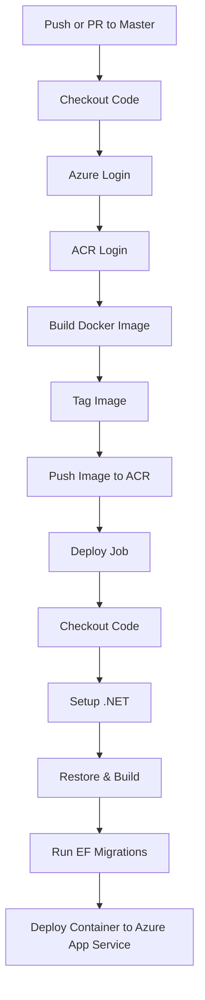

# Docker & Docker Compose Flow Documentation for UserManagement App

## Overview

## Architecture Diagram

```mermaid
flowchart TD
    WEB[WebApp (.NET 9)] -->|Connects| SQL[SQL Server 2022]
    SQL --> VOL[(sql_data Volume)]
    COMPOSE[Docker Compose]
    COMPOSE --> WEB
    COMPOSE --> SQL
```

This document provides a concise explanation of how Docker and Docker Compose work together to build and run the **UserManagement** application, consisting of:

* **webapp** (.NET 9 application)
* **sqlserver** (SQL Server 2022 container)

It also includes a flow diagram illustrating the full lifecycle from build to runtime.

---

## Architecture Summary

### **Containers**

* **webapp**

  * Built using `Dockerfile` in the project root
  * Uses `.NET 9 SDK` to build and `.NET 9 ASP.NET Runtime` to run
  * Connects to SQL Server via internal Docker network

* **sqlserver**

  * Built using `Dockerfile` from `./sqlserver`
  * Exposes port `1433`
  * Persists database files using `sql_data` Docker volume

### **docker-compose.yml**

Defines both services and orchestrates:

* Build order
* Dependencies (`depends_on`)
* Environment variables
* Networks
* Volumes

---

## Docker Compose Flow Diagram

```mermaid
flowchart LR
    A[Source Code] --> B[Dockerfile: Build Stage (SDK 9.0)]
    B --> C[dotnet restore]
    C --> D[dotnet publish]
    D --> E[Runtime Image (ASP.NET 9.0)]
    E --> F[webapp Container]

    A2[SQL Dockerfile] --> B2[Build SQL Image]
    B2 --> G[sqlserver Container]

    F -- Connects via internal network --> G

    G --> V[(sql_data Volume)]

    subgraph Compose
        F
        G
        V
    end
```

---

## Container Interaction Flow

1. **docker compose up --build** is executed.
2. Compose builds images:

   * `webapp` using .NET 9
   * `sqlserver` using SQL Server 2022
3. Compose creates a private network for both containers.
4. SQL Server container starts and initializes.
5. Webapp container starts and reads the environment variable connection string:

   ```
   Server=sqlserver,1433;Database=UserManagement;
   User Id=sa;Password=YourStrong!Passw0rd;
   ```
6. Webapp communicates with SQL Server via Docker DNS (`sqlserver`).
7. Database files persist in the `sql_data` volume.

---

## Commands Summary

### Build and run:

```bash
docker compose up --build
```

### Stop containers:

```bash
docker compose down
```

### Stop and remove volumes:

```bash
docker compose down -v
```

---

If you want, I can expand this into a full README.md or export it as a PDF.

# GitHub Actions CI/CD Pipeline Design Documentation

## Overview

This section documents the GitHub Actions workflow used for building, pushing, and deploying the ASP.NET Core containerized application to **Azure App Service** via **Azure Container Registry (ACR)**.
It includes a flow diagram showing the CI/CD lifecycle.

---

## Workflow Summary

The pipeline performs:

1. **Source checkout**
2. **Azure authentication** using a Service Principal
3. **Docker image build** using the root Dockerfile
4. **Tagging and pushing the image** to Azure Container Registry (ACR)
5. **Running Entity Framework migrations** against Azure SQL Database
6. **Deploying the container** to Azure App Service (Linux)

---

## Azure Components Involved

### **Azure Container Registry (ACR)**

* Stores built Docker images.
* The workflow logs in using the ACR name extracted from the login server.

### **Azure App Service (Linux)**

* Host environment for running the container.
* Pulls images from ACR.

### **Azure SQL Database**

* EF Core database migrations are applied during deployment.

---

## GitHub Secrets Required

| Secret Name                   | Purpose                                       |
| ----------------------------- | --------------------------------------------- |
| `AZURE_CREDENTIALS`           | Service Principal JSON for Azure login        |
| `AZURE_SQL_CONNECTION_STRING` | Connection string used for EF Core migrations |

---

## GitHub Actions Flow Diagram



---

## Job Breakdown

### **Job: build_and_push**

* Builds the Docker image.
* Tags the image with commit SHA.
* Pushes to ACR.
* Must complete before deployment.

### **Job: deploy**

* Runs only on **push to master**.
* Performs EF migrations using the ASP.NET project as startup.
* Deploys the newly pushed container to Azure App Service.

---

## Key Workflow Benefits

* **Immutable deployments** using commit-based image tags.
* **Separation of concerns** between build and deploy jobs.
* **Database migrations included** ensuring schema consistency.
* Secure authentication using GitHub Secrets and Azure Service Principal.
* Fully automated from commit → build → push → migrate → deploy.

---

If you'd like, I can also generate:

* A full README.md for this workflow
* A high-level cloud architecture diagram (Azure-focused)
* A deployment runbook for operations teams
